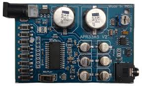

# APR33A3

The APR33A3 is a high-performance voice recording and playback integrated circuit (IC) capable of storing up to 11 minutes of audio. This versatile component is widely used in various applications, including toys, alarms, and voice guidance systems. Its ease of use and robust performance make it a popular choice for both hobbyists and professionals.

Here's an image of a module:

## connection

- 12 V power supply in given (Also the range 3 - 6.5 V)
- rmc connector is used to power via controller
- Pins near audio jack are connected to the speaker
- There 8 pins used to control the audio.
