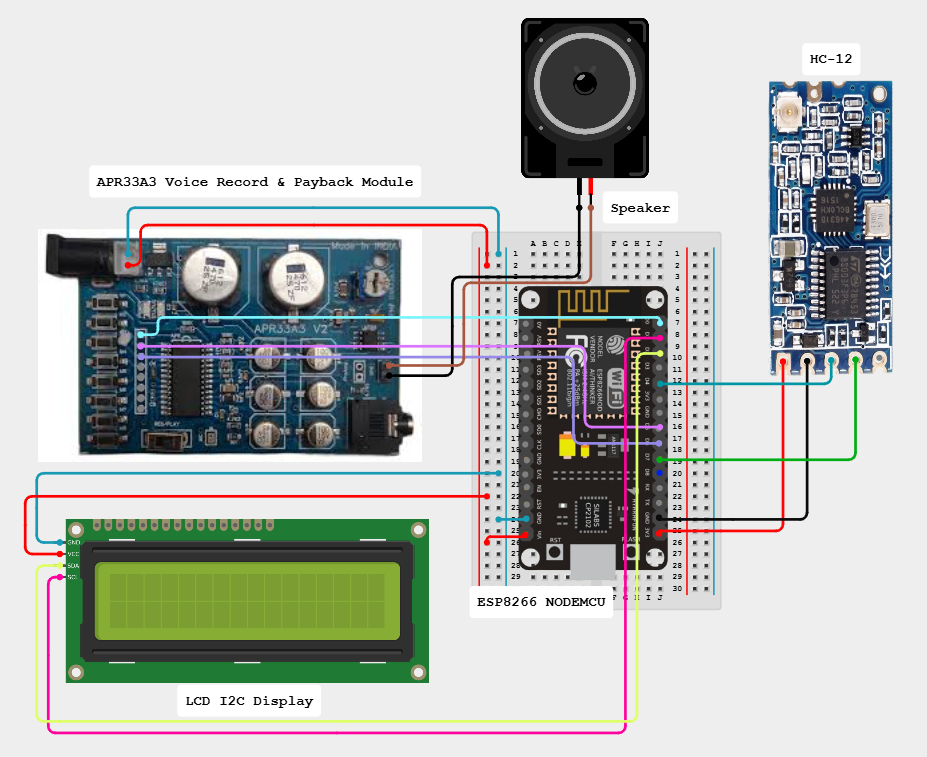

# Abstract

Display the status received from the sensors and alert the supervisor if something goes wrong.

## Components

1. ESp8266 Node MCU
2. APR33A3
3. HC-12 Module
4. LCD display i2c
5. Speaker

## BLOCK DIAGRAM

## Future scope

Datas are pushed to the cloud server for future use.
