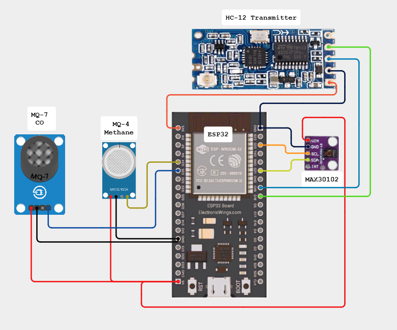

# Abstract 

Detects the senosr value send it to the receiver for every 3 seconds using HC-12 module.

## Components

1. ESP32
2. MAX30102 Heart Rate Module
3. MQ-4 Methane sensor
4. MQ-7 Carbon-monoxide sensor
5. HC-12 module
6. Power bank
7. Cable

## BLOCK DIAGRAM

## Testing
- `https://github.com/SinekaRamu/Embedded-Projects/blob/main/1-SAFE_BOT/Transmitter/safe_bot/safe_bot.ino` tested with sensors
